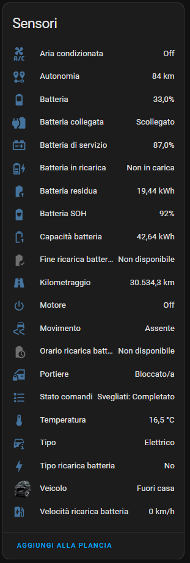

# Stellantis Vehicles
## Requisite

- **Vehicle native mobile app** installed and active;
- **Remote service** compatible vehicle;
- **Use a pc for installation**;

Currently only PSA vehicles are compatibile (Peugeot, Citroen, DS, Opel and Vauxhall).

Currently Stellantis not provide B2C api credentials, this integration use the mobile app auth credentials and flow.

**Inspired by https://github.com/flobz/psa_car_controller (OTP step its a fork).**

## Features

- Get vehicles status;
- Send remote command;
- Set a charge limit (only EV);

## Installation

### Using [HACS](https://hacs.xyz/)
1. Go to HACS section;
2. From the 3 dots menu (top right) click on **Add custom repository**;
3. Add as **Integration** this url https://github.com/andreadegiovine/homeassistant-stellantis-vehicles;
4. Search and install **Stellantis Vehicles** from the HACS integration list;
5. Add this integration from the **Home Assistant** integrations.

### Manually
1. Download this repository;
2. Copy the directory **custom_components/stellantis_vehicles** on your Home Assistant **config/custom_components/stellantis_vehicles**;
3. Restart HomeAssistant;
4. Add this integration from the **Home Assistant** integrations.

## Testing roadmap
- [x] Mokka-e (e-remote)
- [ ] Others EV vehicles
- [ ] Others thermal vehicles
- [ ] Multi vehicles account
- [ ] "Battery capacity" and "Battery residual" sensors validity

Before any issue request please enable the debug log of this integration by your configuration.yaml:

```
logger:
    default: error
    logs:
        custom_components.stellantis_vehicles: debug
```

and paste the log data on the issue request.

## Screenshot




## File "configs.json"

This file contains all app api credentials by culture.

To update this file run the Dockerfile under **configs_updater** directory and use the final output as file content.